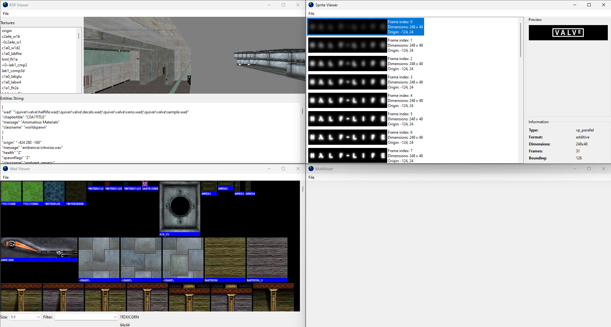

# MultiAsset prototype

This is a prototype program designed to combine prototypes developed for [Half-Life Asset Manager](https://github.com/SamVanheer/HalfLifeAssetManager).

**Do not expect this to be functional, correct or well designed. These are unfinished prototypes, each developed in less than 12 hours each.**

**If you intend to make a program that provides the features planned for Half-Life Asset Manager, please give it a different name to avoid confusion.**

## Prototypes

The following prototypes are included:
* Basic architecture to support multiple asset types
* Sprite viewer
* Wad viewer
* BSP viewer

Example:

This program can open Half-Life 1 file formats `.spr`, `.wad` and `.bsp`.

Sprite viewer is based on the old Sprite Explorer program and allows to view a list of frames, an animated preview running at roughly 10 frames per second and basic information about the sprite's properties.

Wad viewer is based on Valve Hammer Editor's texture browser and allows to view a list of lump type **miptex (67)** textures.

BSP viewer allows to view the world geometry of a BSP file. Any embedded textures used in the map are loaded, any others use a pink and black checkerboard texture.

## Intended purpose

These prototypes were originally developed to be incorporated into Half-Life Asset Manager.

The plan was to overhaul the program's graphics code to use shaders, and then to overhaul the UI to use 2 top level windows (`QMainWindow` derived classes): one containing the file browser, the other being the StudioModel window.

The file browser would have been redesigned to be an asset browser. The existing file filtering would be removed (due to performance issues and lacking user feedback) and would instead have a preview window.

For file types that can be opened the preview window would show the loaded asset. For file types that are known but cannot be opened (e.g. StudioModel sequence group (`filename01.mdl`, `filename02.mdl`, etc) and texture (`filenameT.mdl`) files) the program would explain the purpose of these files and how to open them, for files recognized as being from other games an option to open in another program (if configured) would be provided.

For other files a simple "not supported" message would be shown.

The StudioModel window would be redesigned to simplify the underlying code where possible.

Each asset type would have its own list of assets, which means the `Asset` base class would lose some of its functionality. The OpenGL window currently designed to be shared would be reworked so that there is one instance per use case to avoid problems with decoupling the window.

Each asset type would also have its own top level window which allows things like menus and buttons to be added which isn't possible with the current (3.0.0) design.

After this refactoring work the prototypes would be integrated one at a time.

### Sprite viewer

Sprite viewer would be redesigned to use an OpenGL window for its preview with render mode options to preview the in-game appearance, and the individual frame images would be previewable by switching the preview window to a single frame mode. This would result in most of the Sprite Explorer layout being discarded in favor of one that maximizes the size of the preview window.

Like the StudioModel UI there would be dock panels for each chunk of data:
* Panel showing the list of frames with information about the currently selected frame
* Panel showing sprite information (Sprite Explorer's `Information` group box)

Additionally the sprite properties would be made editable where possible (sprite type and format). Options to export single frames and to animated PNG (see `QImageWriter`) would also be added.

If possible the option to add new frames would be added, but this is limited by the sprite format's 256 color limit. `sprgen` requires all images to use the same colormap, but there are algorithms that can be used to convert an image to use an existing colormap at the cost of reduced image quality and/or accuracy.

The option to duplicate, edit, move and otherwise edit the contents of sprites would be useful as well.

The option to edit the colormap to control the transparent color would also be a nice-to-have feature.

### Wad viewer

Wad viewer is already a pretty good design, but options to preview in-game appearance is helpful, especially for decals.

Wad editing options are possible here, but currently the wad loading code only supports the miptex lump type and not others. Ideally full support would be added for all of them, but some lump types are no longer in use by the Steam version of Half-Life which limits the value of such options.

Additionally the game saves the spraypaint image in a wad as a miptex lump but the lump type id is incorrect which may require special handling.

Like Wally having a cheatsheet describing the various name prefixes would be helpful here.

### BSP viewer

BSP viewer is rather barebones; all it provides is basic rendering and camera controls. A proper viewer should be able to load all textures, which means parsing out the wad list and correctly loading textures from either the BSP file itself or wad files, which may be located in a number of different directories determined by the game's filesystem.

It should also be able to preview entities which means parsing out the entity data and using a user-defined fgd file to interpret the data.

At the very least brush models can be previewed by checking for `model` keys with `*<number>` values.

BSP viewer uses legacy OpenGL but also has some unfinished OpenGL 3.1 code for creating buffers to render with. Don't expect this code to work.

You'll probably want to rewrite the entire renderer to optimize this. BSP file data isn't optimized for modern graphics API use so there is no simple solution. You'll probably want to allocate a list of vertex buffer objects containing triangles, a list of index buffer objects defining the face polygons, and a list that tracks the VBO and IBO of each face.

A good grasp of modern OpenGL is essential to set this up properly. If you've never written an OpenGL-based renderer you probably won't be able to figure this out.
